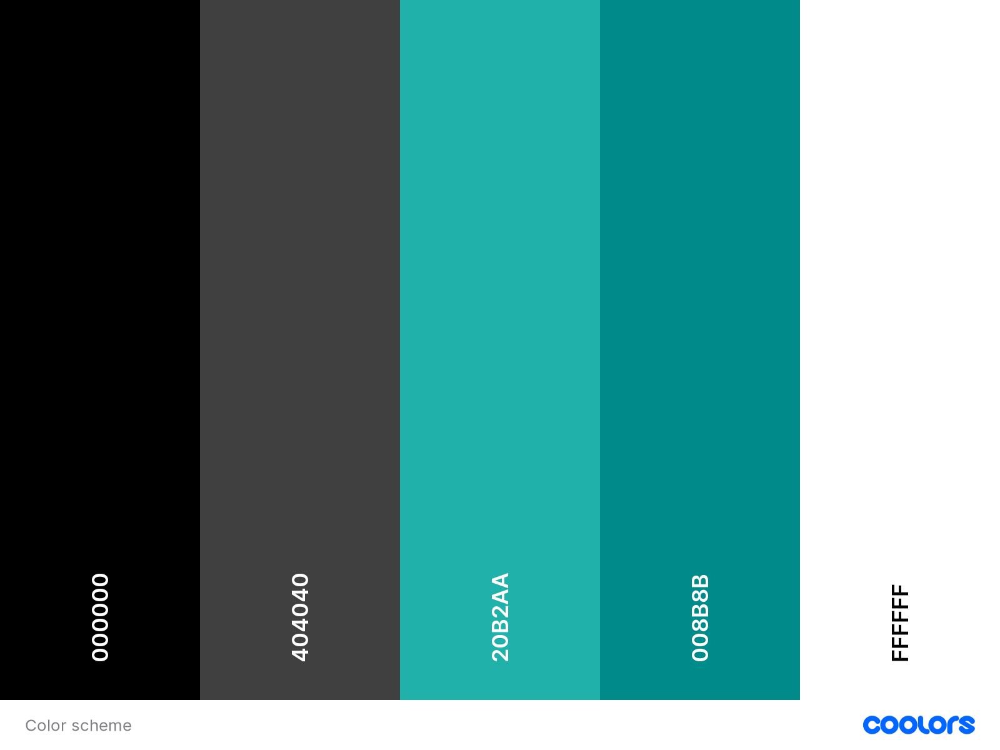
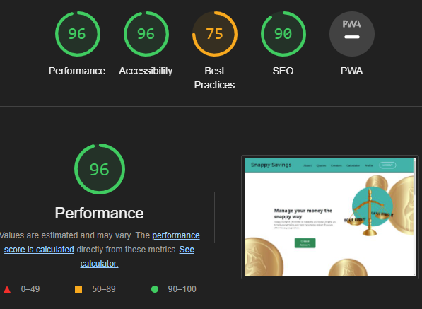
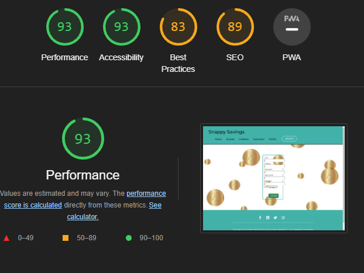
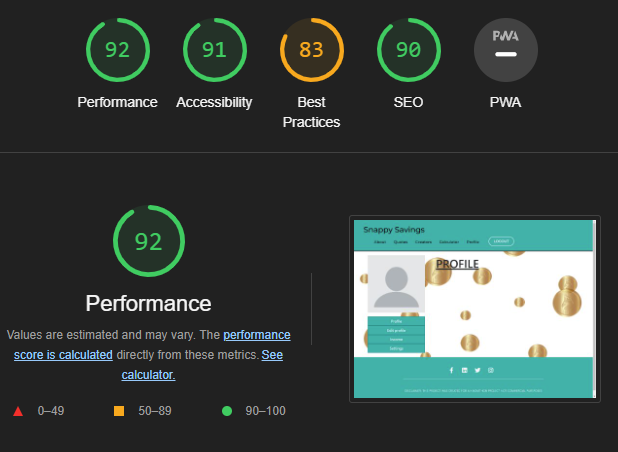

# |Finance App- Snappy Savings
​
## Team Name: Django Unchained

Snappy Savings is a finance website that tells you if you can afford a specific thing or not. The twist is that it does it in a snappy way! This makes figuring out your finances a bit more fun.
​
[Link to Deployed Project](<<add_deployed_link_to_project_here>>)

<br> 

​
## Contents
​
* [User Experience (UX)](#user-experience)
  * [User Stories](#user-stories)
* [Technology](#technology)
* [Design](#design)
  * [Color Scheme](#color-scheme)
  * [Typography](#typography)
  * [Imagery](#imagery)
  * [Wireframes](#wireframes)
* [Deployment & Usage](#deployment)
* [Testing](#testing)
* [Credits](#credits)
  * [Code](#code)
  * [Content](#content)
  * [Media](#media)
  * [Acknowledgements](#acknowledgements)
​
## User Experience 
  - Easily navigate and use the website.
  - Create an account to track spending and if they can afford a purchase
  - Input their savings and what they want to buy
  - Recieve a quirky message on whether they can afford the purchase or not
​
### User stories

As a user of the app I want:
- The ability to have a password protected login, so that my financial information is safe. 
- The abiity to track my spending habits, so I can manage my finances.
- To be motivated to not make purchases I cannot afford.

End user goal: 
- Login using a username and password.
- See a display of recent transactions.
- Recieve messages from the app when inputting something I can or cannot afford.

End business goal: 
- Increase app usage. Acceptance criteria: Allow user to create a profile with confirmation of password, allowing a user to login securely. 
- Improve customer satisfaction. Acceptance criteria: Allow user to see recent transactions and merchant catagories. 
- Make the app fun and increase customer retention. Acceptance criteria: When a user inputs something they can or cannot afford based upon their savings, they will recieve a 
related message. 
​
## Technology

- This website has been written using HTML, CSS, JAVASCRIPT, PYTHON, BOOTSTRAP, DJANGO, 


### Frameworks, Libraries and Programs Used
- Github: Storing and hosting my code/repository
- Gitpod: Code editor for writing my code and storing other images/files
- Font Awesome: For icons used in the site
- Coolors: For choosing the palette to be used in the website
- Google Fonts: To import the fonts used throughout the site
- Google DevTools: Used throughout the site's creation to test responsiveness and adjust layout
- Balsamiq: Wireframe software
- Am I Responsive: To create a visual of the website across different device sizes 
- [Pexels](https://www.pexels.com/) For images used in the website
- [YouTube](https://www.youtube.com/) For inspiration and coding tutorials
- [W3schools](https://www.w3schools.com/) For coding questions and reference
- [Freecodecamp](https://www.freecodecamp.org/) For coding questions and reference
- [Lighthouse](https://developers.google.com/web) To test performance of website
- [Pair fonts](https://pairfonts.com/) To visualize font pairing


​
## Initial MVP idea:
​
 We initially thought about what could set our application apart from other finance apps, and we came up with the idea of producing motivational and funny messages based on whether the user can afford a purchase or not. We then discussed which API we would use and how this would allow the user to track spending. We started to concider the layout of the different pages of the application and decided, based upon early wireframes, that we would have a seperate page for returing users to login as well as for new users to create an account. We decided on an initial color scheme and elements of different pages and discussed how we would implement them 

​
### Actual idea & content:
​
<< how does you final product/project match up to your initial mvp plans >>
​
<< detail idea / features / functionality here >>
​
## Design
​
### Color Scheme:

This website uses a palette of subtle colours that are simple yet eye catching to attract and keep users in the website. 
This palette was created using [Coolors](https://coolors.co/000000-404040-20b2aa-008b8b-ffffff) website


​
### Typography:

[Google Fonts](https://fonts.google.com/) was used to source the font styles used throughout the website:
- Montserrat was used throughout the website. 
- It promotes readability and maintains a clean design.

​
### Imagery:
- Some images were sourced from pexels
[Pexels](https://pexels.google.com/)
- Some images were sourced from pixabay
[Pixabay](https://pixabay.com/vectors/blank-profile-picture-mystery-man-973460/)
- We used imagur to link images to the html pages
[Imagur](https://imgur.com/)
​
## Wireframes

Wireframes were created using [Balsamiq Wireframing Software](https:/balsamiq.com/)

View wireframes [PDF file here](https://github.com/MiaRasmussen05/Hackathon-Jan-23/blob/main/documentation/snappy-savings.pdf)
​
## Deployment

The site was deployed to Heroku following the instructions below.

Django Deployment Instructions:

In the Terminal:
1. Install Django and Gunicorn:
```pip3 install 'django<4' gunicorn```
2. Install supporting libraries:
```pip3 install dj_database_url psycopg2```
3. Install Cloudinary Libraries:
```pip3 install dj3-cloudinary-storage```
4. Create requirements file:
```pip3 freeze --local > requirements.txt```
5. Create Project:
```django-admin startproject PROJECT_NAME .```
6. Create App:
```python3 manage.py startapp APP_NAME```
In settings.py:
7. Add to installed apps:
```
INSTALLED_APPS = [
…
'APP_NAME',
]
```
In the Terminal:
8. Migrate changes:
```python3 manage.py migrate```
On ElephantSQL:
9. Log in to your ElephantSQL account
10. Click “Create New Instance”
11. Set up your plan:
   - Give your plan a Name (this is commonly the name of the project)
   - Select the Tiny Turtle (Free) plan
   - You can leave the Tags field blank
12. Click “Select Region” (Note: If you receive a message saying "Error: No cluster available in your-chosen-data-center yet", choose another region)
13. Click “Review”, then click “Create instance”
14. Return to the ElephantSQL dashboard and click on the database instance name for this project
15. Copy your ElephantSQL database URL using the Copy icon. It will start with postgres://
In Heroku:
16. Create new Heroku App:
```APP_NAME, Location = Europe```
17. Open the "Settings" tab
18. Click "Reveal Congig Vars" (Note: The value should be the ElephantSQL database url you copied in the previous step)
In Gitpod:
19. Create new env.py file on top level directory
20. Import os library
```import os```
21. Set environment variables:
```os.environ["DATABASE_URL"] = "Paste in ElephantSQL database URL"```
22. Add in Secret Key:
```os.environ["SECRET_KEY"] = "Make up your own randomSecretKey"```
In Heroku:
23. Add Secret Key to Config Vars
```SECRET_KEY, “randomSecretKey”```
In settings.py:
24. Reference env.py:
```
import os
import dj_database_url

if os.path.isfile("env.py"):
   import env
```
25. Remove the insecure secret key and replace (links to the SECRET_KEY variable on Heroku)
```SECRET_KEY = os.environ.get('SECRET_KEY')```
26. Comment out the old Databases section:
```
# DATABASES = {
#     'default': {
#         'ENGINE': 'django.db.backends.sqlite3',
#         'NAME': BASE_DIR / 'db.sqlite3',
#     }
# }
```
27. Add new Databases section (links to the DATATBASE_URL variable on Heroku):
```
DATABASES = {
   'default': dj_database_url.parse(os.environ.get("DATABASE_URL"))
}
``` 
In the Terminal:
28. 
```python3 manage.py migrate```
In Cloudinary:
29. Copy your CLOUDINARY_URL:
```From Cloudinary Dashboard```
In env.py:
30. Add Cloudinary URL:
```os.environ["CLOUDINARY_URL"] = "cloudinary://************************"```
In Heroku:
31. Add Cloudinary URL to Heroku Config Vars:
```COUDINARY_URL, cloudinary://************************``` 
32. Add DISABLE_COLLECTSTATIC to Heroku Config Vars (temporary step for the moment, will be removed before deployment)
```DISABLE_COLLECTSTATIC, 1```
In settings.py:
33. Add Cloudinary Libraries to installed apps (Note: order is important):
```
INSTALLED_APPS = [
    …,
    'cloudinary_storage',
    'django.contrib.staticfiles',
    'cloudinary',
    …,
]
```
34. Tell Django to use Cloudinary to store media and static files (place under the Static files note):
```
STATIC_URL = '/static/'

STATICFILES_STORAGE = 'cloudinary_storage.storage.StaticHashedCloudinaryStorage'
STATICFILES_DIRS = [os.path.join(BASE_DIR, 'static')]
STATIC_ROOT = os.path.join(BASE_DIR, 'staticfiles')

MEDIA_URL = '/media/'
DEFAULT_FILE_STORAGE = 'cloudinary_storage.storage.MediaCloudinaryStorage'

```
35. Link file to the templates directory in Heroku
(place under the BASE_DIR line):
```TEMPLATES_DIR = os.path.join(BASE_DIR, 'templates')```
36. Change the templates directory to TEMPLATES_DIR
(place within the TEMPLATES array)
```
TEMPLATES = [
    {
        …,
        'DIRS': [TEMPLATES_DIR],
       …,
            ],
        },
    },
]
```
37. Add Heroku Hostname to ALLOWED_HOSTS:
```ALLOWED_HOSTS = ["PROJ_NAME.herokuapp.com", "localhost"]```
In Gitpod:
38. Create static and templates folders on top level directory
39. Create Procfile on the top level directory
In Procfile:
40. Add code:
```web: gunicorn PROJ_NAME.wsgi```
In the Terminal:
41. After saving all files, add, commit and push:
```git add .```
```git commit -m “...”```
```git push```
In Heroku:
42. Click on "Deploy" tab, select Github as deployment method, on main branch, and deploy content manually


​
## Testing

### HTML
 [W3C Markup Validator](https://validator.w3.org/nu/) - validation service used. 

<br>

### CSS

 [W3C CSS Validator](https://jigsaw.w3.org/css-validator/#validate_by_address)  - validation service used. 

<details>
<summary>Stylesheet</summary>


</details>

### Lighthouse testing 

<details>
<summary>Landingpage</summary>


</details>

<details>
<summary>calculator</summary>


</details>

<details>
<summary>Profile</summary>


</details>

<details>
​
## Credits

- We used some code from [Swipper](https://swiperjs.com/demos#infinite-loop-with-slides-per-group) to create the carousel of the user stories and the creators.
- We used some code from [11bus11](https://github.com/11bus11/book-store1) to create the backend base as well as the login page.
​
​
### Acknowledgements

- The team members, for working so hard to ensure that the project was at its best.
- The mentors, for their guidance with the technical issues we had. 
- Code Institute, for providing a platform where we can learn, build our skills and connect with fellow peers. 